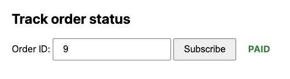

# Отчет о проделанной работе. 

1. Все запускается через `docker compose up --build`
2. Соблюдено ТЗ на transactional inbox/outbox
3. Все api методы реализованы
4. Реализован websocket + frontend к нему. Фронт доступен по 'webapp/index.html'
5. Тесты я не делал - в падлу. прошу простить мне эти 0.5 и посмотреть на вебсокет.

