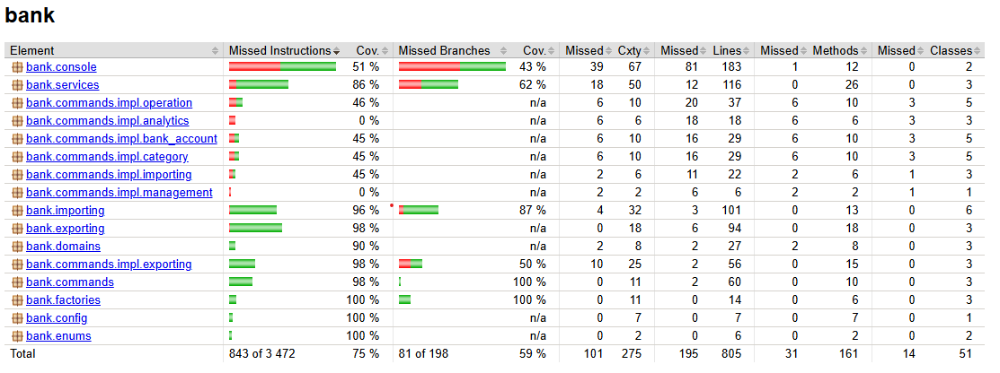

# Отчёт по разработке модуля «Учёт финансов»

---

## 1. Введение

В данном проекте был разработан модуль **«Учёт финансов»** для банковского приложения. Цель модуля — предоставлять возможности по:

- Созданию, редактированию и удалению банковских счетов, категорий и операций (доходных и расходных).
- Дополнительной функциональности, такой как аналитика, импорт/экспорт данных в разных форматах, пересчёт для согласованности данных и замеры времени работы.

---

## 2. Доменные классы и их роль

### 2.1 BankAccount
- Поля: `id`, `name`, `balance`.
- Представляет банковский счёт с текущим балансом.

### 2.2 Category
- Поля: `id`, `name`, `type` (доход/расход).
- Используется для группировки операций; содержит enum `CategoryType` (например, `INCOME` или `EXPENSE`).

### 2.3 Operation
- Поля: `id`, `operationType` (например, `DEPOSIT`, `WITHDRAWAL`), `bankAccountId`, `amount`, `date`, `description`, `categoryId`.
- Отражает одну финансовую операцию (доход или расход).

Создание и валидация объектов производится через **фабрики** (например, `BankAccountFactory`), чтобы новые объекты нельзя было создать некорректными (`balance < 0` и т.д.).

---

## 3. Принципы SOLID

1. **Single Responsibility (SRP)**
    - Каждый класс доменной модели (BankAccount, Category, Operation) отвечает только за данные и базовые операции над ними.
    - Фабрики сосредоточены на создании и валидации, сервисы (например, `FinanceService`) — на CRUD-логике.

2. **Open/Closed (OCP)**
    - Расширение функционала (например, новые форматы экспорта или импорта) делается путём добавления новых импортёров/экспортёров, не затрагивая код доменной модели.

3. **Liskov Substitution (LSP)**
    - Все реализации `Command<T>` могут взаимозаменяемо использоваться в любом месте, где ожидается команда.

4. **Interface Segregation (ISP)**
    - Разделили интерфейсы фабрик (например, `InBankAccountFactory`, `InCategoryFactory`) для каждого доменного класса, избегая избыточных методов.

5. **Dependency Inversion (DIP)**
    - Верхнеуровневые модули зависят от абстракций (например, сервис зависит только от интерфейса фабрик), а не от конкретных реализаций.

---

## 4. GRASP: High Cohesion и Low Coupling

- **High Cohesion**
    - Классы фабрик сфокусированы лишь на создании объектов; сервис — на CRUD и проверке связей; аналитика — на расчётных операциях. Каждая подсистема решает узкий круг задач.

- **Low Coupling**
    - Модули и классы взаимодействуют через чёткие интерфейсы. Команды не знают подробностей создания доменных объектов — всё передаётся через сервисы и фабрики.

---

## 5. Шаблоны проектирования (GoF)

### 5.1 Фабрика (Factory)
- **Зачем**: централизовать логику создания доменных объектов и не допускать невалидные экземпляры.
- **Реализация**: `BankAccountFactory`, `CategoryFactory`, `OperationFactory` с методами `create(...)` и проверками.

### 5.2 Фасад (Facade)
- **Зачем**: упростить доступ к группам операций. Может использоваться для объединения логики по категориям/операциям/счетам.
- **Пример**: отдельный класс-«фасад», где собраны методы для Аналитики.

### 5.3 Команда (Command)
- **Зачем**: каждая операция (например, "создать счёт" или "изменить категорию") оформлена как команда. Это упрощает добавление новых сценариев и подключение декораторов. Так же я реализовал транзакции, можно собирать команды в одну группу и потом исполнять.
- **Реализация**: `CreateBankAccountCommand`, `DeleteOperationCommand`, `GetIncomeExpenseDifferenceCommand` и др., все реализуют `Command<T>`.

### 5.4 Декоратор (Decorator)
- **Зачем**: добавлять функционал (например, логирование времени) без изменения кода команд.
- **Пример**: `TimingCommandDecorator` измеряет время выполнения `execute()` у команды.

### 5.5 Шаблонный метод (Template Method)
- **Зачем**: общий алгоритм для импорта данных, отличающийся лишь парсингом (CSV, JSON, YAML).
- **Реализация**: абстрактный класс `AbstractImportTemplate` с методами `importData`, `persistRows`. Конкретные классы (`CsvImport`, `JsonImport`) переопределяют `parseContent`.

### 5.6 Посетитель (Visitor)
- **Зачем**: разделить логику экспорта (разные форматы) от самих доменных объектов, которые лишь вызывают `accept`.
- **Реализация**: `CsvExportVisitor`, `JsonExportVisitor`, `YamlExportVisitor` обрабатывают BankAccount, Category и Operation по-своему, формируя строку/файл.

---

## 6. Дополнительные возможности

1. **Аналитика**
    - Класс `AnalyticsService` (или команды вроде `GetIncomeExpenseDifferenceCommand`) обрабатывают операции для расчёта доходов/расходов, делают группировку, сортировку и др.

2. **Пересчёт баланса**
    - `DataManagementService` (и команда `RecalculateBalanceCommand`) пересматривают баланс счёта, исходя из связанных операций, чтобы устранить несоответствия.

3. **Импорт/Экспорт**
    - **Импорт**: команды `ImportFromCsvCommand`, `ImportFromJsonCommand`, т. п., используют реализацию `AbstractImportTemplate`.
    - **Экспорт**: команды `ExportAllDataToCsvCommand`, `ExportAllDataToJsonCommand`, `ExportAllDataToYamlCommand` обходят сущности и используют посетителя для итогового формата.

4. **Измерение времени**
    - `TimingCommandDecorator` замеряет продолжительность `execute()` у любой команды.

5. **Транзакции**
   - В консоли можно собирать команды, а потом исполнять их всех с помощью `commit`.

---

## 7. Тестирование и покрытие

- **Юнит-тесты**: покрывают фабрики, сервисы (`FinanceService`), команды и аналитику.
- **Тесты консоли**: перехватывают `System.in`/`System.out` для имитации ввода скриптов, проверяя обработку команд, включая ветки ошибок.
- **Покрытие**: используя JaCoCo, достигается 75%.

