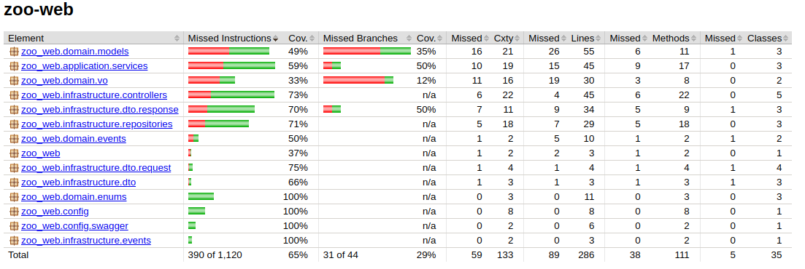

# Zoo Web App — Отчёт по ДЗ №2

## Описание

> **DDD + Clean Architecture**.

---

## Реализованный функционал

### 🐾 CRUD операций:
| Сущность      | Операции реализованы | Где |
|---------------|-----------------------|-----|
| Animal        | Create, Read, Delete  | `AnimalController`, `AnimalInMemoryRepository` |
| Enclosure     | Create, Read, Delete  | `EnclosureController`, `EnclosureInMemoryRepository` |
| FeedingSchedule | Create, Read        | `FeedingController`, `FeedingScheduleInMemoryRepository` |

## Domain-Driven Design: применено

### Value Objects:
- `AnimalId`, `EnclosureId` – как UUID-обёртки.

### Богатые доменные модели:
- Логика расселения, кормления, статусы (`HEALTHY`, `SICK`) находятся **внутри моделей**, а не раскиданы по контроллерам.

### Инкапсуляция бизнес-правил:
- Проверка вместимости вольера — `Enclosure.addAnimal(...)`
- Перемещение животных — через `Animal.moveToEnclosure(...)`
- Кормление — через `FeedingSchedule.markCompleted(...)`

---

## Clean Architecture: реализовано

| Слой           | Содержимое                     | Примеры                      |
|----------------|--------------------------------|------------------------------|
| `domain`       | Модели, value objects, интерфейсы репозиториев | `Animal`, `Enclosure`, `AnimalRepository` |
| `application`  | Бизнес-логика, сервисы         | `AnimalTransferService`, `FeedingOrganizationService` |
| `infrastructure` | In-memory-репозитории         | `AnimalInMemoryRepository`, `FeedingScheduleInMemoryRepository` |
| `presentation` | Контроллеры                    | `AnimalController`, `FeedingController` |

**Зависимости направлены внутрь**:  
Презентация зависит от application, а application — только от интерфейсов в domain.

---

## Swagger + Валидация

- DTO размечены с помощью `jakarta.validation` (`@NotNull`, `@NotBlank`, `@FutureOrPresent`)
- Для документации используется `@Schema(description = ..., example = ...)` — всё красиво, клиенты довольны.
- Swagger UI работает, можно кликать кнопки и кормить животных в браузере.

---

## Тесты

### Интеграционные:

| Что тестируем              | Класс                                                 |
|----------------------------|-------------------------------------------------------|
| CRUD для животных          | `AnimalIntegrationTest`                               |
| CRUD для вольеров          | `EnclosureIntegrationTest`                            |
| Перемещение животного      | `AnimalTransferIntegrationTest`                       |
| Кормление                  | `FeedingIntegrationTest` (забил так как нафармил 65%) |
| Статистика                 | `ZooStatisticsIntegrationTest`                        |

Использован `@SpringBootTest + @AutoConfigureMockMvc`, всё гоняется через HTTP-имитацию.

